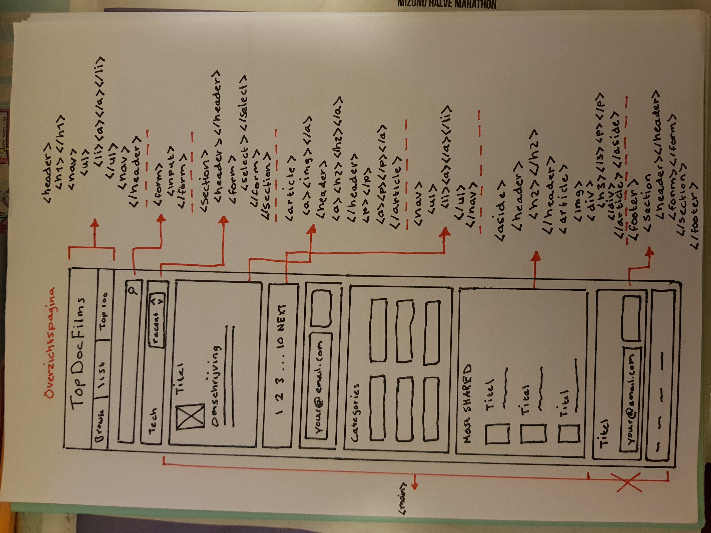
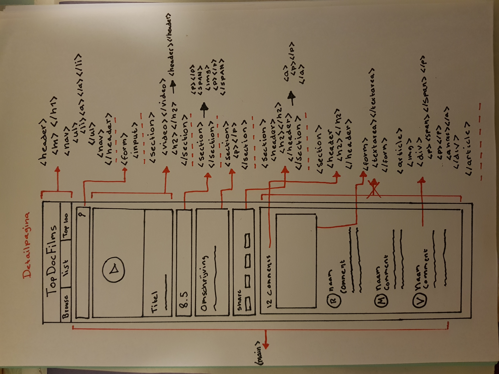

# Frontend-responsive-design
Voor het vak Frontend @CMD Amsterdam, ga ik de site https://topdocumentaryfilms.com/ zoveel mogelijk namaken.
Om precies te zijn kies ik de volgende twee pagina's van de site om na te maken:
 
 
  - Overzichtspagina:
  https://topdocumentaryfilms.com/category/technology/page/1/

  - Detailpagina:
  https://topdocumentaryfilms.com/bitcoin-beyond-bubble/
 
   

De site moet uiteindelijk `mobiel`, `tablet` en `desktop` vriendelijk zijn.

**Mijn startniveau:** `Blauwe piste`  
**Mijn focus:** `Helemaal responsive`

## Criteria
### 1.) De HTML is gestructureerd en semantisch opgemaakt
 

Schets voor de **overzichtspagina**

Schets voor de **detailpagina**

        - Single column layout (mobile first)
        
De bouw van de site benader ik vanuit een mobile first approach. Ik heb daarom eerst naar de mobiele variant van de 
[site](https://topdocumentaryfilms.com) gekeken. Vervolgens heb ik van de overzichtspagina en de detailpagina een schets
gemaakt met de belangrijkste elementen van de pagina. Deze elementen heb ik voorzien van HTML-elementen die me passend 
leek. Hierbij heb ik natuurlijk het overmatig gebruik van DIV's vermeden.  

### 2.) De basis principes van CSS zijn begrepen en toegepast

Om de HTML-elementen op de pagina een styling en positionering te geven maak ik gebruik van verschillende technieken. Zo
heb ik zowel gebruik gemaakt van Flexbox als CSS Grids. Om de ervaring op de site op ieder scherm zo prettig mogelijk te 
maken, heb ik zoveel mogelijk gebruik gemaakt van flexible units als: em in plaats van px. Om meer interactiviteit naar
de gebruiker te tonen maak ik hier en daar ook gebruik van pseudo class `:hover`.

### 3.) De site is responsive

De site is responsive gebouwd. Dit is in grote lijnen bereikt door rekening te houden met twee breakpoints. De eerste
breakpoint is voor de Tablet's 

### 4.) Er is een werkende interactie met js gemaakt

### 5.) Er is geëxperimenteerd met verschillende technieken
